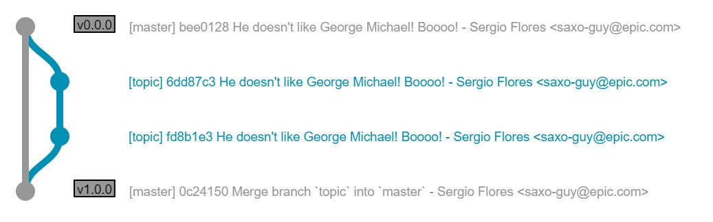

# gitgraphwrapper.js
[](https://travis-ci.org/opengl-8080/gitgraphwrapper.js)

## What is this?
Simple [gitgraph.js](https://github.com/nicoespeon/gitgraph.js) wrapper that seemed more like a command line.

## Example


If you draw an above graph with gitgraph.js as is, implementation is following.

```js
// gitgraph.js
var gitGraph = new GitGraph();

var master = gitGraph.branch('master');
master.commit().tag('v0.0.0');

var topic = master.branch('topic');
topic.commit().commit().merge(master);

master.tag('v1.0.0');
```

Drawing same graph using this wrapper is following.

```js
// GitGraphWrapper
new GitGraphWrapper()
    .branch('master')
    .checkout('master')
    .commit()
    .tag('v0.0.0')

    .branch('topic')
    .checkout('topic')
    .commit()
    .commit()

    .checkout('master')
    .merge('topic')
    .tag('v1.0.0')
;
```

It looks like using git comamnd at command line.

Probably, you may execute git command like following  at actual command line. (`add` command is omitted.)

```bash
$ git checkout master

$ git commit ...

$ git tag v0.0.0

$ git branch topic

$ git checkout topic

$ git commit ...

$ git commit ...

$ git checkout master

$ git merge topic

$ git tag v1.0.0
```

## Explanation
### GitGraphWrapper
`GitGraphWrapper` wraps `GitGraph` and provides api like using command line .

Basically each methods simply delegates to GitGraph's methods.  
Therefore you can pass same arguments that GitGraph method arguments to wrapper method.

### GitGraphWrapperExtention
GitGraphWrapper is simple wrapper for GitGraph.  
Method arguments is compatible with GitGraph's method arguments.

But unfortunately, as a result some operations are redundant.  
For example, making branch with `branch()` method and moving HEAD with `checkout()` method.

Usally you may execute git command as following.

```bash
$ git checkout -b branch_name
```

`GitGraphWrapperExtention` extends `GitGraphWrapper` and lets implementations like above.

Some method's argument are extended, so you need specify any some method's argument.  
But implementations will become to be similar to command line.

For example, like followings.

```js
// GitGraphWrapperExtention
new GitGraphWrapperExtention()
    .checkout('-b', 'master')
    .commit()
    .tag('v0.0.0')
    
    .checkout('-b', 'topic')
    .commit()
    .commit()

    .checkout('master')
    .merge('topic')
    .tag('v1.0.0')
;
```

It is also enable to create new branch from specified other branch like `checkout('-b', 'new_branch', 'start_branch')`.

More details are [usage.html](usage/usage.html).

-----

## これはなに？
[gitgraph.js](https://github.com/nicoespeon/gitgraph.js) をラップして、よりコマンドに近い形で実装できるようにしたものです。

## 例


例えば上のようなグラフを描こうとした場合、 girgraph.js をそのまま使うと次のようになります。

```js
// gitgraph.js
var gitGraph = new GitGraph();

var master = gitGraph.branch('master');
master.commit().tag('v0.0.0');

var topic = master.branch('topic');
topic.commit().commit().merge(master);

master.tag('v1.0.0');
```

同じグラフを、このラッパーを使って書くと次のようになります。

```js
// GitGraphWrapper
new GitGraphWrapper()
    .branch('master')
    .checkout('master')
    .commit()
    .tag('v0.0.0')

    .branch('topic')
    .checkout('topic')
    .commit()
    .commit()

    .checkout('master')
    .merge('topic')
    .tag('v1.0.0')
;
```

より、コマンドラインで git コマンドを実行しているときに近い形なったかと思います。

ちなみに、実際にコマンドラインで同じことをすると、次のようになるでしょう（`add` などは省略しています）。

```bash
$ git checkout master

$ git commit ...

$ git tag v0.0.0

$ git branch topic

$ git checkout topic

$ git commit ...

$ git commit ...

$ git checkout master

$ git merge topic

$ git tag v1.0.0
```

## 説明
### GitGraphWrapper
`GitGraphWrapper` は、 `GitGraph` をラップしてコマンドラインでコマンドを入力しているかのような API を提供します。

各メソッドは、基本的に単純に `GitGraph` に処理を委譲しています。  
このため、メソッドの引数には `GitGraph` の同名のメソッドと同じものが渡せます。

### GitGraphWrapperExtention
`GitGraphWrapper` は、 `GitGraph` の単純なラッパーです。  
メソッドの引数は、基本的に `GitGraph` のメソッドと互換性を持つようにしています。

しかし、その結果として一部の操作が冗長になっています。  
たとえば、 `branch()` でブランチを作ってから `checkout()` で HEAD を移動させるところなどです。

普通、コマンドラインでそのような操作をするときは `git checkout -b branch_name` とすると思います。

`GitGraphWrapperExtention` は、 `GitGraphWrapper` を拡張して似たようなことをできるようにします。

引数は一部拡張されており、 `GitGraph` にはない引数を指定する必要はありますが、よりコマンドラインに近い形で実装できるようになっています。

例えば、例に上げた実装は次のように実装できます。

```js
// GitGraphWrapperExtention
new GitGraphWrapperExtention()
    .checkout('-b', 'master')
    .commit()
    .tag('v0.0.0')
    
    .checkout('-b', 'topic')
    .commit()
    .commit()

    .checkout('master')
    .merge('topic')
    .tag('v1.0.0')
;
```

かなりコマンドラインでの実行に近い形になっているかと思います。

`checkout('-b', 'new_branch', 'start_point')` のように、ブランチの起点を指定して新しいブランチを作ることもできます。

詳しくは [usage.html](usage/usage.html) を参照してください。

## Release Note
### English
- v1.0.0
    - first release

### 日本語
- v1.0.0
    - 初回リリース
